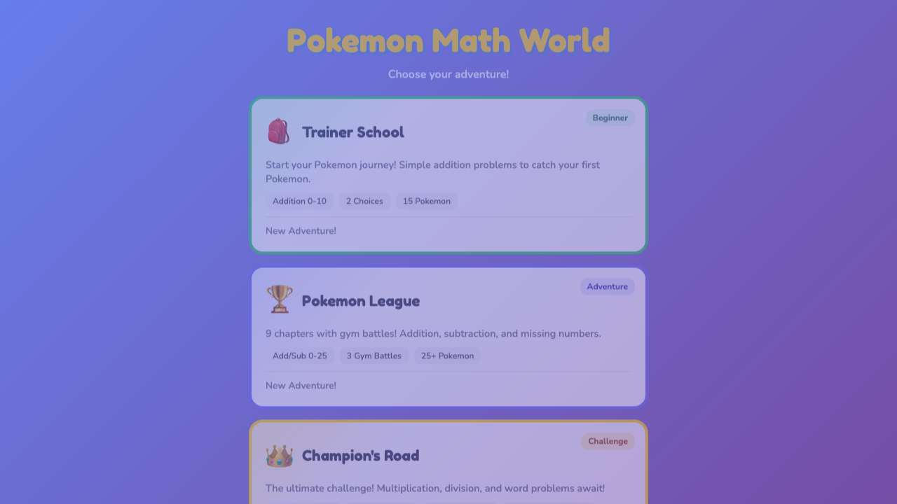

# Pokemon Math World

A progressive math learning game for elementary students. Three difficulty levels take players from simple addition through multiplication, division, and word problems.

**Live Demo**: https://ngnnah.github.io/I-And-AI/projects/pokemon-math-world/

## Difficulty Levels

### Trainer School (Beginner)

- Addition 0-10
- 2 answer choices
- 3 chapters with 3-5 questions each
- Perfect for Grade 1 beginners

### Pokemon League (Adventure)

- Addition & subtraction 0-25
- Missing number problems (? + 5 = 12)
- 9 chapters with gym battles
- 3 gym badges to earn (Brock, Misty, Lt. Surge)
- 25+ Pokemon to catch
- Perfect for Grade 1-2

### Champion's Road (Challenge)

- Addition & subtraction up to 100
- Multiplication (2s, 5s, and mixed times tables)
- Division (up to 10)
- Word problems at 1st grade reading level
- 8 chapters including Elite Four battles
- Legendary Pokemon (Articuno, Zapdos, Moltres, Mewtwo, Mew)
- Perfect for advanced Grade 1 / Grade 2

## Features

- **8 Trainer Characters** - Ash, Red, Blue, Green, Ethan, Lyra, Brendan, May
- **Name Customization** - Player's name shown throughout
- **40+ Pokemon** - Including starters, wild, gym, elite, and legendary
- **Gym & Elite Four Battles** - Boss battles with badges/trophies
- **Progress Saving** - localStorage per difficulty level
- **Sound Effects** - Web Audio API for feedback
- **Mobile Friendly** - Touch-optimized, responsive design
- **Streak Bonuses** - Extra stars for consecutive correct answers

## How Progress is Saved

Each difficulty level saves progress separately to localStorage:

| Level           | Storage Key              |
| --------------- | ------------------------ |
| Trainer School  | `pokemon-trainer-school` |
| Pokemon League  | `pokemon-league-save`    |
| Champion's Road | `pokemon-champions-road` |

**What's saved:**

- Player name and trainer selection
- Current chapter progress
- Pokemon collection
- Badges earned
- Stars and best streak

## Math Topics by Level

| Topic              | Trainer School | Pokemon League | Champion's Road |
| ------------------ | -------------- | -------------- | --------------- |
| Addition 0-10      | Yes            | Yes            | Yes             |
| Addition 10-25     | -              | Yes            | Yes             |
| Addition 25-100    | -              | -              | Yes             |
| Subtraction        | -              | Yes            | Yes             |
| Missing Numbers    | -              | Yes            | Yes (to 100)    |
| Multiplication 2s  | -              | -              | Yes             |
| Multiplication 5s  | -              | -              | Yes             |
| Multiplication All | -              | -              | Yes             |
| Division           | -              | -              | Yes             |
| Word Problems      | -              | -              | Yes             |

## Project Structure

```
pokemon-math-world/
├── index.html           # Main entry point
├── css/
│   └── styles.css       # All styles
└── js/
    ├── main.js          # App initialization
    ├── data/
    │   ├── pokemon.js   # Pokemon stats, types, sprites
    │   ├── trainers.js  # Trainer and gym leader data
    │   └── levels.js    # Level configs and question generators
    ├── game/
    │   ├── state.js     # Game state and localStorage persistence
    │   ├── questions.js # Question generation utilities
    │   ├── audio.js     # Sound effects (Web Audio API)
    │   └── utils.js     # Confetti, screen management, helpers
    └── screens/
        ├── world-select.js  # Level selection
        ├── setup.js         # Character creation
        ├── chapter.js       # Chapter selection
        ├── battle.js        # Battle/question screen
        ├── catch.js         # Catch animation
        └── victory.js       # Level completion
```

## Tech Stack

- **ES Modules** - Modular JavaScript, no build required
- **Vanilla JavaScript** - no frameworks
- **CSS3** - animations, gradients, responsive design
- **localStorage API** - persistent game state per level
- **Web Audio API** - sound effects
- **PokeAPI sprites** - Pokemon images
- **Pokemon Showdown sprites** - Trainer avatars

## Development

To run locally:

```bash
cd projects/pokemon-math-world
python3 -m http.server 8080
# Open http://localhost:8080
```

## Tools Used

- **Claude Code** - AI pair programming
- **GitHub Pages** - Free hosting with CI/CD
- **PokeAPI** - Pokemon sprite CDN
- **Pokemon Showdown** - Trainer sprite CDN

## Screenshots



_Level selection screen with three difficulty tiers_

## Related Projects

This project combines and extends:

- [Pokemon Math (Beginner)](../pokemon-math/) - Original simple version
- [Pokemon Math Adventure](../pokemon-math-advanced/) - Original adventure version

## Credits

- Pokemon is a trademark of Nintendo/Game Freak
- Sprites from PokeAPI and Pokemon Showdown (fan resources)
- Built for educational purposes only
